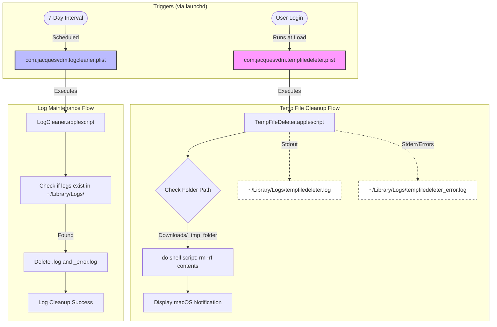

# GEMINI.md

This file provides foundational mandates and guidance for Gemini CLI when working with MacBootTmpDeleter. Instructions in this file take absolute precedence over general defaults.

## Project Mandates

1. **Path Integrity:** Always use `~/Library/Application Support/MacBootTmpDeleter/` as the target for logic scripts. Do not revert to hardcoded absolute paths within the source directory for installation.
2. **Log Safety:** Never attempt to delete log files from within the same script that `launchd` is using for `StandardOutPath` or `StandardErrorPath`. Use the dedicated `LogCleaner.applescript` for log maintenance.
3. **Surgical Updates:** When modifying AppleScripts, prefer shell-based operations (`do shell script`) for speed and reliability unless complex Finder-specific logic is required.

## Project Structure

- `TempFileDeleter.applescript` - Main cleanup script (runs on login).
- `LogCleaner.applescript` - Log maintenance script (runs weekly).
- `com.jacquesvdm.tempfiledeleter.plist` - LaunchAgent for temp file deletion.
- `com.jacquesvdm.logcleaner.plist` - LaunchAgent for log cleanup.
- `install.sh` - Installation script (handles unloading, copying to App Support, and loading).
- `uninstall.sh` - Uninstallation script (handles unloading and removal of all artifacts).

## System Architecture



## Technical Context

- **Target Directory:** `/Users/jacquesvandermerwe/Downloads/_tmp_folder`
- **Logs:** `~/Library/Logs/tempfiledeleter.log` and `tempfiledeleter_error.log`.
- **Scheduling:** Uses `RunAtLoad` for immediate execution on login and `StartInterval` for weekly cleanup.

## Commands for Gemini

### Installation/Management
```bash
./install.sh    # Install or update the service
./uninstall.sh  # Remove the service and its files
```

### Verification
```bash
# Check service status
launchctl list | grep jacquesvdm

# Check for cleanup success (if folder is empty)
ls -A ~/Downloads/_tmp_folder

# View logs
tail -f ~/Library/Logs/tempfiledeleter.log
tail -f ~/Library/Logs/tempfiledeleter_error.log
```

### Testing
```bash
# Test scripts manually (requires files in target folder)
osascript TempFileDeleter.applescript
osascript LogCleaner.applescript
```
